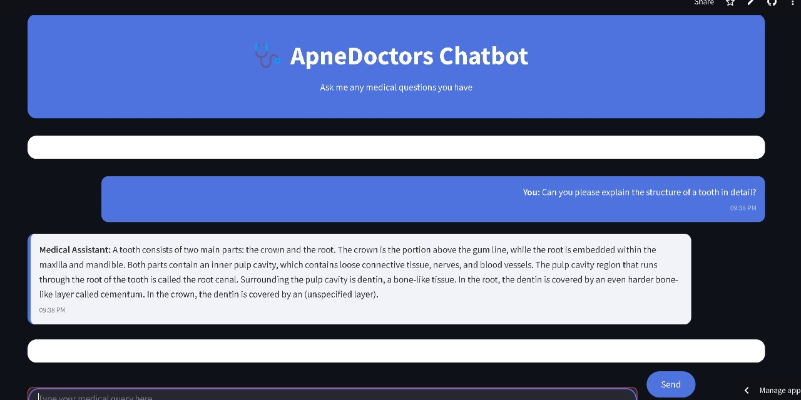

# 🩺 Medical Assistant Chatbot

A powerful AI-driven Medical Chatbot built with **LangChain**, **Groq's LLaMA 3 70B**, **FAISS**, and **Streamlit**. This chatbot helps users get instant responses to their medical queries using a custom-trained vector database of medical knowledge.

 <!-- Replace with your actual image path -->

---

## 🚀 Features

- 🧠 **LLaMA 3 70B Model (Groq)** – Lightning-fast and accurate responses.
- 📚 **Context-aware medical Q&A** – Based on your uploaded medical PDFs.
- 🔍 **FAISS vector search** – Efficient and accurate semantic search.
- 🎨 **Beautiful UI** – Clean, responsive, and user-friendly interface.
- 🧾 **Chat history with timestamps** – Scrollable and styled chat logs.

---

## 🛠️ Tech Stack

- **Frontend:** Streamlit
- **LLM Backend:** Groq (LLaMA 3 70B)
- **Embeddings:** HuggingFace (MiniLM-L6-v2)
- **Vector DB:** FAISS
- **Orchestration:** LangChain
- **Deployment:** Streamlit Cloud / Custom

---

## 📸 Screenshot

Upload your screenshot image in the `assets/` folder and name it `screenshot.png`. Update the README if using a different name or location.

---

## 🧠 How It Works

1. **Embeddings** are generated using HuggingFace and stored in FAISS.
2. **User Input** is passed to Groq’s LLaMA 3 model through LangChain’s RetrievalQA.
3. **Contextual Search** is done on your medical PDFs to generate relevant answers.
4. **Results** are displayed in a styled Streamlit UI with proper chat formatting.

---

## ❗Note

This tool is for **informational purposes only** and should not be used as a substitute for professional medical advice, diagnosis, or treatment.

---

## 👨‍💻 Author

**Aryan Pawar**  
B.Tech CSE | Manipal University Jaipur

